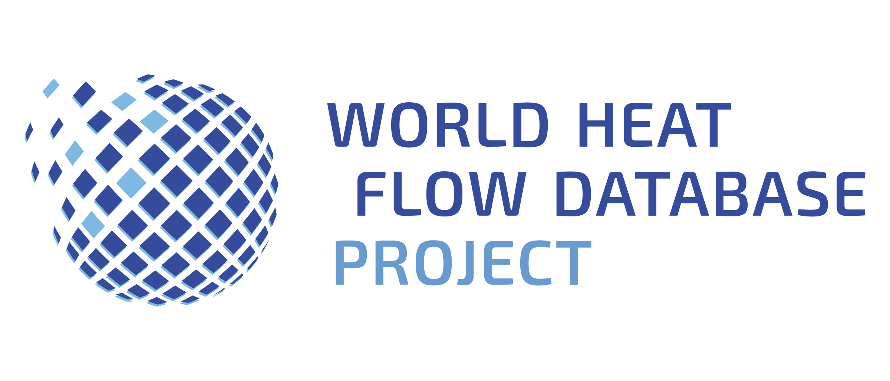

# portal.heatflow.world

This repository hosts the codebase of [portal.heatflow.world](https://portal.heatflow.world). The portal is a custom-built webapp that allows users to access and contribute heat flow data to the Global Heat Flow Database (GHFDB). For more information on how the portal works, see the [documentation](https://heatflowworld.readthedocs.io/).

## Suggestions and improvements

The portal is very much a work in progress, and we are continuously working on improving its functionality and user experience. If you have found a bug or encountered an issue while using the portal, please report it via the [issue tracker](https://github.com/ihfc-iugg/ghfdb-portal/issues). We appreciate your help in making the portal better for everyone.

For general feedback or suggestions, we encourage you to use the [discussion forum](https://github.com/ihfc-iugg/ghfdb-portal/discussions). This is a great place to share your thoughts, ask questions, and engage with the community. Whether you have ideas for new features, improvements to existing functionality, or just want to discuss the portal's design, we welcome your input.

There are currently two polls open in the discussion forum to determine what features to prioritize next. One poll is focused on [features for the portal in it's entirety](https://github.com/ihfc-iugg/ghfdb-portal/discussions/82), while the other is focused specifically on the [map viewer functionality](https://github.com/ihfc-iugg/ghfdb-portal/discussions/83). Your participation in these polls is invaluable as it helps us understand the needs and preferences of our users. By voting, you can influence the direction of the portal's development and ensure that we are working on features that matter most to you.

## Acknowledgements

This codebase is maintained by the [German Research Centre for Geosciences (GFZ)](https://www.gfz-potsdam.de/en/) as part of the [World Heat Flow Database Project](https://www.heatflow.world). This project is funded by the [Deutsche Forschungsgemeinschaft (DFG)](https://www.dfg.de) under the project number [491795283](https://gepris-extern.dfg.de/gepris/projekt/491795283).

We extend our gratitude to all individuals, organizations, and institutions who have contributed to and supported this project. For a complete list of contributors, see [CONTRIBUTORS.md](./CONTRIBUTORS.md).

## Supporting Organizations

 

  

  

