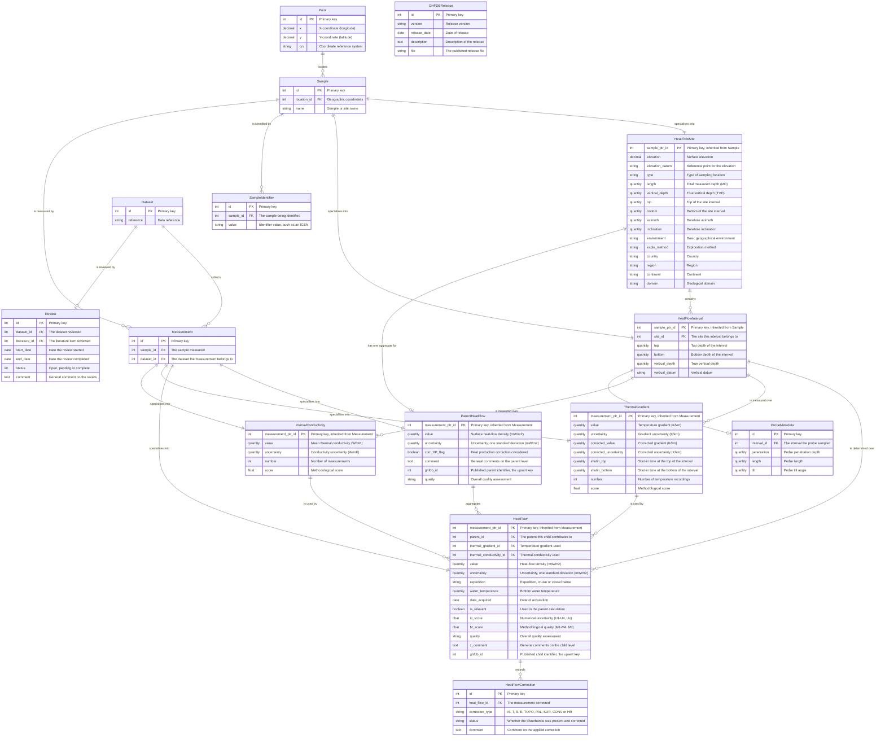
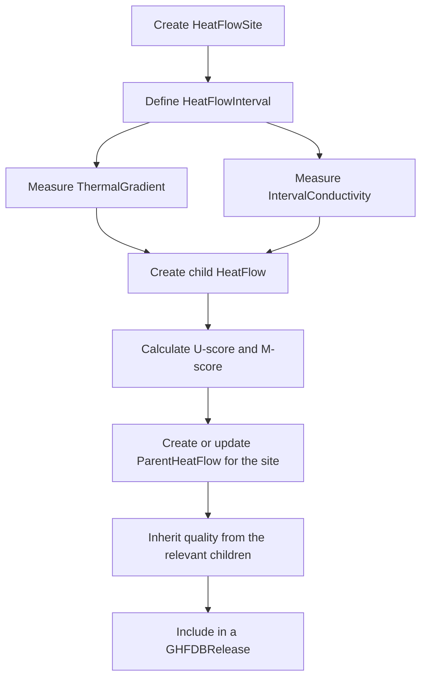

# GHFDB and Heat Flow Data Models

## Overview

This page holds the entity relationship diagram for the tables behind the Global Heat Flow Database, together with a description of each model and the rules it enforces. It covers the same ground as the [conceptual model](ghfdb-conceptual-model.md), at the level of tables, keys and cardinalities rather than entities.

The structure consists of:

- **Sites** (`HeatFlowSite`): geographic locations where measurements were taken
- **Depth intervals** (`HeatFlowInterval`): the depth range within a site over which a determination applies
- **Parent heat flow** (`ParentHeatFlow`): the aggregated surface heat flow value for a site
- **Child heat flow** (`HeatFlow`): individual determinations with their quality metrics
- **Supporting measurements**: thermal gradient, thermal conductivity, probe metadata and corrections
- **Editorial records**: review progress and published release files

For the mapping between the columns of the published spreadsheet and these models, see
[GHFDB Fields](../ghfdb_fields.md).

## Key Concepts

### Data hierarchy

The GHFDB implements a two-level structure:

1. **Parent level** (`ParentHeatFlow`): the site-specific heat-flow density at Earth's surface, after aggregating and correcting the child measurements. One parent per site.

2. **Child level** (`HeatFlow`): individual determinations calculated from thermal gradient and conductivity measurements. Several children can contribute to one parent, and each child records whether it was used in that calculation.

A child does not point at its site directly. It hangs off a depth interval, and the interval belongs to the site, so a child reaches its site as `sample.heatflowinterval.site`.

### Quality scoring

The database implements a quality assurance scheme with two indicators:

- **U-score** (numerical uncertainty), from the coefficient of variation: U1 excellent, U2 good, U3 ok, U4 poor, Ux not determined
- **M-score** (methodological quality), from the measurement methodology: M1 excellent, M2 good, M3 ok, M4 poor, Mx not determined

## Entity Relationship Diagram

Entities drawn from FairDM — `Sample`, `Measurement`, `Point`, `Dataset` — are shown only where a
relationship crosses into them, and only with the fields that relationship uses. Vocabulary
relationships are left off: nearly every model has several, and each is a join table onto a shared
concept table, so drawing them would triple the size of the diagram without saying anything about
the heat flow schema. The `Database Table` column of
[GHFDB Fields](../ghfdb_fields.md) names the join table for each of them.

`GHFDBChild` and `GHFDBParent` are also absent. They are proxy models over `HeatFlow` and
`ParentHeatFlow` used by the flat import and export views, and a proxy has no table of its own.

## Model Descriptions

### HeatFlowSite

A geographical location where heat flow data has been collected. It extends FairDM's borehole and earth sample models, which themselves extend `Sample`.

**Key features**

- Reaches its geographic coordinates through `Sample.location`, a foreign key to `Point`
- Tracks both measured depth (`length`) and true vertical depth (`vertical_depth`)
- Categorises the setting through the geographic environment vocabulary
- Carries country, region, continent and domain, each indexed for filtering

**Rules**

- A site refuses a coordinate pair already held by another site, checked on both `clean()` and `save()`
- A site may have many depth intervals
- A site may have at most one `ParentHeatFlow`, enforced in that model's `save()`

### HeatFlowInterval

A depth interval within a site's borehole, over which a child determination applies. Like the site it extends `Sample`, so it can carry its own identifiers and be measured directly.

**Key features**

- Belongs to a site through the `site` foreign key, and the relation is nullable
- Tracks top and bottom depth, vertical depth and vertical datum
- Carries the geological vocabularies: lithology, age and stratigraphic unit
- Is the sample that thermal gradient, thermal conductivity and child heat flow measurements point at

**Rules**

- Bottom depth must be at or below top depth, in a downward-positive direction

### ParentHeatFlow

The aggregated surface heat flow for a site: the parent level of the published schema. It was named `SurfaceHeatFlow` in older versions of this codebase.

**Key features**

- Reaches its site through `Measurement.sample`, and exposes it as the `site` property
- Stores the representative value after all corrections
- `corr_HP_flag` records whether the heat production of the overburden was considered
- `ghfdb_id` is the published parent identifier and the key imports upsert on

**Rules**

- Its sample must be a `HeatFlowSite`, and only one parent may exist per site — both raise on `save()`
- Quality is inherited from the children: one child passes its own score up, several pass the poorest of the relevant ones

### HeatFlow

An individual heat flow determination over a depth interval: the child level of the published schema.

**Key features**

- Calculated from a thermal gradient and a thermal conductivity, each an optional foreign key
- Points at its parent through the nullable `parent` foreign key, and `is_relevant` records whether it was used in the parent's value
- Carries the U-score and M-score, both indexed, and the overall quality assessment
- `ghfdb_id` is the published child identifier and the key imports upsert on
- A determination is treated as a marine probe measurement when its interval carries probe metadata

**Rules**

- Its sample must be a `HeatFlowInterval`, raised on `save()`
- Each child belongs to at most one parent, through a plain foreign key rather than a junction table

### ProbeMetadata

Instrument parameters for a marine heat flow probe.

**Key features**

- One record per interval, through a one-to-one foreign key to `HeatFlowInterval`
- Records penetration depth, probe type, length and tilt
- Every field but the interval is optional, so partial records are accepted

**Rules**

- Deleted with its interval

### HeatFlowCorrection

One disturbance considered for one child measurement. Corrections are records rather than boolean flags on the measurement, because a boolean cannot express whether a disturbance was recognised, considered or corrected.

**Correction types**

- **IS**: in-situ pressure and temperature conditions
- **T**: temperature corrections
- **S**: sedimentation and subsidence effects
- **E**: erosion effects
- **TOPO**: topographic effects
- **PAL**: paleoclimatic effects
- **SUR**: surface and climatic effects, such as glaciation or warming
- **CONV**: convection effects
- **HR**: heat refraction effects

**Rules**

- At most one record of each type per measurement, enforced by a unique constraint on the pair
- A status that is not meaningful for its type is refused on `save()`. The valid combinations are listed in [GHFDB Fields](../ghfdb_fields.md)
- Indexed by type and by status
- Deleted with its measurement

### ThermalGradient

A temperature gradient measured over a depth interval.

**Key features**

- Reaches its interval through `Measurement.sample`
- Stores both the measured and the corrected gradient, each with an uncertainty
- Records the temperature method, shut-in time and correction method at the top and bottom of the interval
- `score` is the methodological score used in the child's M-score, indexed alongside `number`

**Rules**

- Its sample must be a `HeatFlowInterval`, raised on `save()`
- The number of temperature recordings must be positive where it is given, enforced by a check constraint

### IntervalConductivity

The mean thermal conductivity over a depth interval.

**Key features**

- Reaches its interval through `Measurement.sample`
- Records the sample source, the location the value came from, the determination method, the saturation state and the pressure-temperature conditions
- `score` is computed from those properties following Fuchs et al. (2023) and lands between 0.2 and 1.2

**Rules**

- Its sample must be a `HeatFlowInterval`, raised on `save()`
- Uncertainty may not exceed the value itself
- Values outside 0.1 to 50 W/mK are refused as unrealistic

### Review

The editorial record of a dataset being reviewed before publication.

**Key features**

- One review per dataset and per literature item, both one-to-one
- Names the people who carried it out through the `reviewers` relation, so a review may have several
- Tracks start and completion dates as partial dates, and a status of open, pending or complete

**Rules**

- A start date later than the completion date is refused on `save()`

### GHFDBRelease

A published release of the database: its version, date, description and the file distributed for it. Versions are unique.

## Data Flow

### Creating a heat flow measurement

### Quality score inheritance

The parent heat flow quality is determined by:

1. **One relevant child**: the parent takes that child's quality directly
2. **Several relevant children**: the parent takes the poorest of them

Children marked as not relevant are left out of the calculation entirely, which is how an outlier or a poor determination is kept in the record without dragging the site's value down.

## Database Indices

The following fields are indexed:

- **HeatFlowSite**: `country`, `continent`, `environment`
- **ParentHeatFlow**: `ghfdb_id`, `corr_HP_flag`
- **HeatFlow**: `U_score`, `M_score`, and `ghfdb_id` through the field's own index
- **HeatFlowCorrection**: `correction_type`, `status`
- **ThermalGradient**: `score`, `number`
- **IntervalConductivity**: `number`

## Key Constraints

1. **One parent per site**, and its sample must be a site
2. **One correction of each type per child measurement**
3. **One site per coordinate pair**
4. **Positive temperature recordings** on a thermal gradient, where the count is given
5. **Realistic conductivity**, between 0.1 and 50 W/mK, with an uncertainty no larger than the value

## Vocabulary Fields

Many fields draw on controlled vocabularies through `ConceptField` and `ConceptManyToManyField`. Each many-to-many vocabulary field has its own join table, named for the model and the field, and those names are listed in [GHFDB Fields](../ghfdb_fields.md).

The vocabularies in use include the geographic environment, exploration method and purpose, heat flow determination method, probe type, temperature methods and corrections at the top and bottom of an interval, the conductivity source, location, method, saturation and pressure-temperature conditions, and the lithology and geological timescale terms carried by a site and an interval.

## References

- Fuchs, S., Norden, B., & International Heat Flow Commission. (2021). A new database structure for the IHFC Global Heat Flow Database. *International Journal of Terrestrial Heat Flow and Applications*, 4(1), 1-14.

- Fuchs, S., Beardsmore, G., Chiozzi, P., Espinoza-Ojeda, O. M., Gola, G., Gosnold, W., Harris, R., Jennings, S., Liu, S., Negrete-Aranda, R., Neumann, F., Norden, B., Poort, J., Rajver, D., Ray, L., Richards, M., Smith, J., Tanaka, A., & Verdoya, M. (2023). The Global Heat Flow Database: Update 2023. *GFZ Data Services*. https://doi.org/10.5880/fidgeo.2023.017

- Fuchs, S., Balling, N., & Förster, A. (2023). Quality-assurance of heat-flow data: The new structure and evaluation scheme of the IHFC Global Heat Flow Database. *Geothermics*, 107, 102593.

## See Also

- [The conceptual model](ghfdb-conceptual-model.md) — the entities and the reasoning behind the parent-child split
- [GHFDB Fields](../ghfdb_fields.md) — every published column and the field that holds it
- [Specifications](../development/specifications.md) — the detailed field specifications
