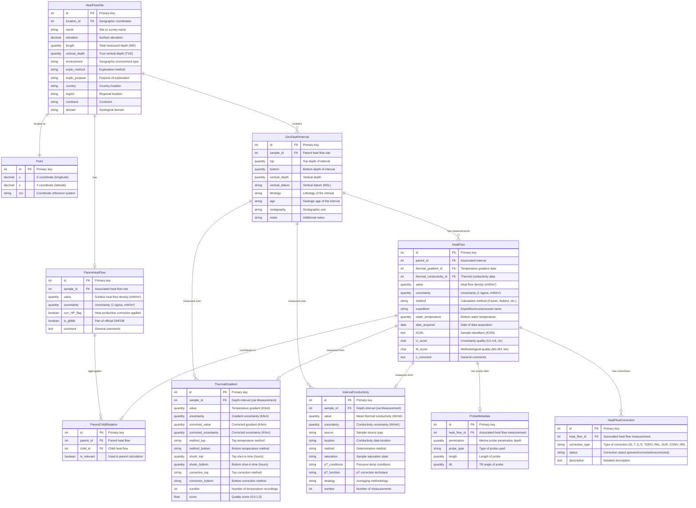
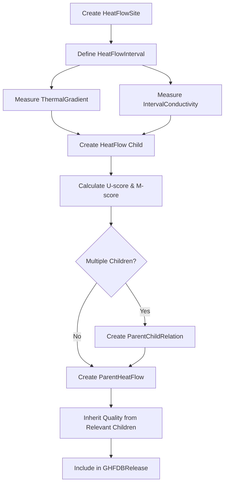

# GHFDB and Heat Flow Data Models

## Overview

This document provides an Entity Relationship Diagram (ERD) for the Global Heat Flow Database (GHFDB) and Heat Flow models. The database follows a hierarchical parent-child structure as described in Fuchs et al. (2021) and Fuchs et al. (2023).

The structure consists of:
- **Sites** (HeatFlowSite): Geographical locations where measurements are taken
- **Parent Heat Flow** (ParentHeatFlow): Aggregated surface heat flow values per site
- **Child Heat Flow** (HeatFlow): Individual heat flow determinations with quality metrics
- **Supporting Data**: Thermal gradient, thermal conductivity, and intervals

## Key Concepts

### Data Hierarchy

The GHFDB implements a two-level structure:

1. **Parent Level** (ParentHeatFlow): Represents the site-specific heat-flow density at Earth's surface after aggregating and correcting child measurements. One parent per site.

2. **Child Level** (HeatFlow): Individual heat flow determinations calculated from thermal gradient and conductivity measurements. Multiple children can contribute to one parent.

### Quality Scoring

The database implements a quality assurance scheme with two quality indicators:

- **U-score** (Numerical Uncertainty): Evaluates uncertainty based on coefficient of variation (U1=Excellent, U2=Good, U3=Ok, U4=Poor, Ux=Unknown)
- **M-score** (Methodological Quality): Evaluates measurement methodology and data quality (M1=Excellent, M2=Good, M3=Ok, M4=Poor, Mx=Unknown)

## Entity Relationship Diagram

## Model Descriptions

### Point (Location)

The **Point** model represents geographic coordinates used across the database.

**Key Features:**
- Stores x (longitude) and y (latitude) coordinates as high-precision decimals (6 decimal places ≈ 0.11m accuracy)
- Coordinate reference system (CRS) tracks the spatial reference used (default: EPSG:4326 - WGS84)
- Provides latitude/longitude properties for convenience
- Unique constraint on (x, y) coordinate pairs

**Business Rules:**
- Each unique location is stored once and can be referenced by multiple sites
- CRS is typically not user-editable to maintain consistency
- Coordinates must be within valid ranges for the specified CRS

### HeatFlowSite

The **HeatFlowSite** model represents a geographical location where heat flow data has been collected. It extends FairDM's `Borehole` model (which itself extends `Sample`) to include heat-flow-specific metadata.

**Key Features:**
- Links to Point model for geographic coordinates (accessed via `location.latitude`, `location.longitude`)
- Tracks both measured depth (MD) and true vertical depth (TVD)
- Categorizes by environment (onshore/offshore, continental/marine)
- Links to exploration method and purpose
- Supports geographic indexing for spatial queries

**Business Rules:**
- Each site can have multiple depth intervals for measurements
- Each site should have exactly one ParentHeatFlow (enforced at model level)
- Geographic coordinates managed through relationship to Point model

### GeoDepthInterval

The **GeoDepthInterval** model represents depth intervals within heat flow sites, providing geological context for measurements.

**Key Features:**
- Extends FairDM's abstract `GeoDepthInterval` to provide concrete implementation for heat flow database
- Tracks top and bottom depths with automatic depth calculation
- Includes geological properties: lithology, age, and stratigraphy
- Vertical datum typically set to Mean Sea Level (MSL)
- Related to both thermal gradient and thermal conductivity measurements

**Business Rules:**
- Bottom depth must be greater than top depth (downward positive direction)
- Vertical depth automatically calculated from top and bottom
- Each interval belongs to one HeatFlowSite
- Multiple thermal gradients and conductivities can be measured over the same interval
- Lithology, age, and stratigraphy support many-to-many relationships for complex geology

### ParentHeatFlow

The **ParentHeatFlow** model stores the aggregated surface heat flow value for a site, representing the "parent level" of the GHFDB schema.

**Key Features:**
- One-to-one relationship with HeatFlowSite (one parent per site)
- Stores the representative heat flow value after all corrections
- Tracks whether heat production corrections were applied
- Links to multiple child measurements via ParentChildRelation
- Indicates whether data is part of official GHFDB release

**Business Rules:**
- Only one ParentHeatFlow allowed per site (validated in save method)
- Quality score inherited from child measurements (poorest relevant child)
- Uncertainty should be non-negative

### HeatFlow (Child)

The **HeatFlow** model represents individual heat flow determinations at specific depth intervals, corresponding to the "child level" of the GHFDB schema.

**Key Features:**
- Calculated from thermal gradient and thermal conductivity measurements
- Supports both borehole and marine probe methodologies (via optional ProbeMetadata relationship)
- Environmental and methodological corrections tracked via many-to-many HeatFlowCorrection relationship
- Quality metrics (U-score for uncertainty, M-score for methodology)
- One-to-one relationships with ThermalGradient and IntervalConductivity

**Business Rules:**
- Each child can only belong to one parent via ParentChildRelation
- Quality scores calculated automatically based on uncertainty and methodology
- Marine probe measurements distinguished by presence of ProbeMetadata

### ProbeMetadata

The **ProbeMetadata** model stores marine heat flow probe-specific information.

**Key Features:**
- Optional one-to-one relationship with HeatFlow (only for marine probe measurements)
- Tracks penetration depth, probe type, length, and tilt angle
- All fields are optional to accommodate varying levels of data completeness

**Business Rules:**
- Only exists for marine probe measurements
- When present, indicates the measurement was taken using a probe rather than a borehole
- Automatically deleted when associated HeatFlow is deleted (CASCADE)

### HeatFlowCorrection

The **HeatFlowCorrection** model tracks environmental and methodological corrections applied to heat flow measurements.

**Key Features:**
- Many-to-many relationship with HeatFlow via foreign key
- Nine correction types: IS (in-situ), T (temperature), S (sedimentation), E (erosion), TOPO (topographic), PAL (paleoclimatic), SUR (surface/climatic), CONV (convection), HR (heat refraction)
- Status field indicates whether correction was present, corrected, or uncorrected
- Optional description field for detailed correction information
- Unique constraint ensures only one correction of each type per heat flow measurement

**Correction Types:**
- **IS**: In-situ pressure/temperature conditions
- **T**: Temperature corrections
- **S**: Sedimentation/subsidence effects
- **E**: Erosion effects
- **TOPO**: Topographic effects
- **PAL**: Paleoclimatic effects
- **SUR**: Surface/climate effects (glaciation, warming)
- **CONV**: Convection effects
- **HR**: Heat refraction effects

**Business Rules:**
- One correction record per type per heat flow measurement (unique_together constraint)
- Indexed by correction_type and status for efficient filtering
- Automatically deleted when associated HeatFlow is deleted (CASCADE)

### ThermalGradient

The **ThermalGradient** model stores temperature gradient measurements used in heat flow calculations.

**Key Features:**
- Inherits `sample` field from Measurement base class, linking to GeoDepthInterval
- Stores both measured and corrected gradient values with uncertainties
- Tracks measurement method at top and bottom of interval
- Records shut-in times and correction methods
- Quality score ranges from 0.0 (poor) to 1.0 (excellent)
- Supports number tracking for statistical confidence

**Business Rules:**
- Uncertainty must be non-negative
- Number of recordings must be positive if specified
- Corrected values indicate whether drilling perturbations were addressed
- Related to GeoDepthInterval via inherited `sample` field from Measurement

### IntervalConductivity

The **IntervalConductivity** model represents mean thermal conductivity over a depth interval.

**Key Features:**
- Inherits `sample` field from Measurement base class, linking to GeoDepthInterval
- Tracks sample source (outcrop, core, cuttings, etc.)
- Records measurement location and method
- Considers saturation state and pressure-temperature conditions
- Implements quality scoring based on Fuchs et al. (2023) criteria
- Supports various averaging strategies for vertical interval

**Business Rules:**
- Value must be positive
- Uncertainty cannot exceed the conductivity value
- Realistic conductivity range: 0.1 to 50 W/mK (validated in clean method)
- Quality score ranges from 0.2 (minimum) to 1.2 (maximum)
- Related to GeoDepthInterval via inherited `sample` field from Measurement

### ParentChildRelation

The **ParentChildRelation** model is an intermediary table managing the many-to-many relationship between parent and child heat flow measurements.

**Key Features:**
- Links parent (aggregated) to child (individual) measurements
- `is_relevant` flag indicates which children were used in parent calculation
- Enforces unique constraint (one child cannot belong to multiple parents)

**Business Rules:**
- Each child heat flow can only be linked to one parent (unique constraint on child_id)
- Only relevant children affect parent quality score
- Enables filtering of outlier or poor-quality child measurements from aggregation

## Data Flow

### Creating a Heat Flow Measurement

### Quality Score Inheritance

The parent heat flow quality is determined by:

1. **Single Child**: Parent inherits child's quality score directly
2. **Multiple Children (all relevant)**: Parent inherits poorest child quality
3. **Multiple Children (some relevant)**: Parent inherits poorest relevant child quality

This ensures conservative quality assessment at the parent level.

## Database Indices

The following fields are indexed for query performance:

### HeatFlowSite
- `country`, `continent`, `environment` (filtering by location/type)

### ParentHeatFlow
- `is_ghfdb`, `corr_HP_flag` (filtering by inclusion/correction status)

### HeatFlow
- `U_score`, `M_score` (quality-based filtering)

### ThermalGradient
- `score`, `number` (quality assessment queries)

### IntervalConductivity
- `number` (measurement confidence queries)

## Key Constraints

1. **Positive Values**: Uncertainties, probe dimensions, conductivity values must be non-negative
2. **Uniqueness**: One parent per site, one child per parent-child relation
3. **Referential Integrity**: Cascading deletes for thermal properties when child is deleted
4. **Geographic Validity**: Coordinates must use WGS84 (SRID 4326)
5. **Quality Ranges**: Scores must fall within defined ranges (0.0-1.0 for gradients)

## Vocabulary Fields

Many fields use controlled vocabularies via `ConceptField` and `ConceptManyToManyField`:

- **Geographic Environment**: onshore_continental, onshore_lake, offshore_continental, offshore_marine, unspecified
- **Exploration Method**: drilling, mining, tunneling, probing_lake, probing_ocean, unspecified
- **Heat Flow Method**: fourier, bullard, bootstrap, other
- **Probe Type**: corer_outrigger, bullard, lister, ewing, other, unspecified
- **Temperature Method**: BHT, CBHT, DST, PT100, PT1000, LOG, CLOG, DTS, CPD, etc.
- **Correction Flags**: not_present, present_uncorrected, present_corrected, unspecified

These vocabularies ensure data consistency and enable standardized filtering and analysis.

## References

- Fuchs, S., Norden, B., & International Heat Flow Commission. (2021). A new database structure for the IHFC Global Heat Flow Database. *International Journal of Terrestrial Heat Flow and Applications*, 4(1), 1-14.

- Fuchs, S., Beardsmore, G., Chiozzi, P., Espinoza-Ojeda, O. M., Gola, G., Gosnold, W., Harris, R., Jennings, S., Liu, S., Negrete-Aranda, R., Neumann, F., Norden, B., Poort, J., Rajver, D., Ray, L., Richards, M., Smith, J., Tanaka, A., & Verdoya, M. (2023). The Global Heat Flow Database: Update 2023. *GFZ Data Services*. https://doi.org/10.5880/fidgeo.2023.017

- Fuchs, S., Balling, N., & Förster, A. (2023). Quality-assurance of heat-flow data: The new structure and evaluation scheme of the IHFC Global Heat Flow Database. *Geothermics*, 107, 102593.

## See Also

- [FairDM Core Data Model](../core-data-model.md) - Understanding Sample and Measurement base classes
- [FairDM Registry](../../developer-guide/registry.md) - Model registration and configuration
- [GHFDB Specification](../development/specifications.md) - Detailed field specifications
