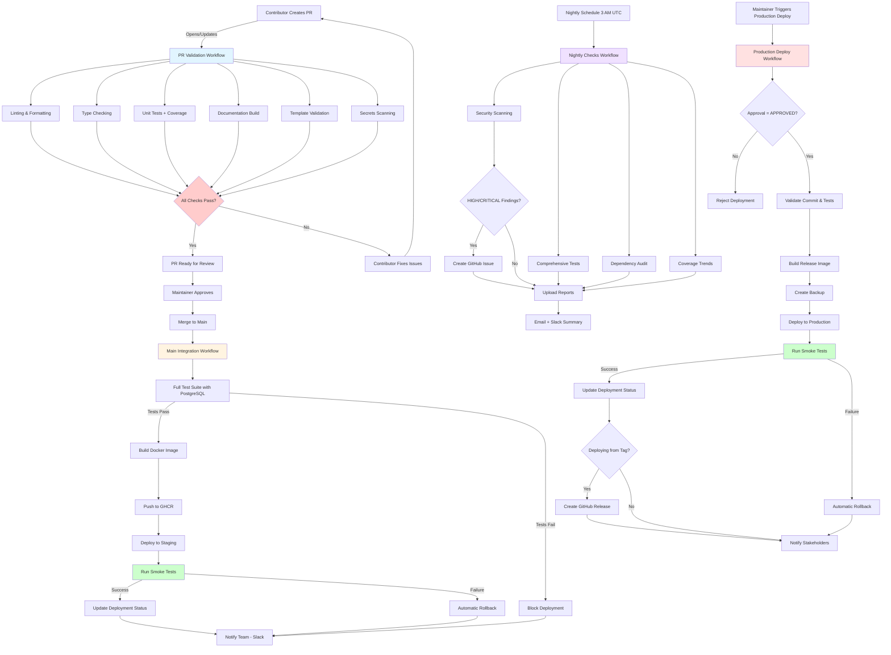

# CI/CD Pipeline Flow Diagram

## Workflow Triggers

| Workflow | Trigger | Purpose | Duration |
| -------- | ------- | ------- | -------- |
| **PR Validation** | Pull request opened/updated | Fast feedback on code quality, tests, docs | <5 minutes |
| **Main Integration** | Push to `main` branch | Full testing, build, staging deployment | ~15 minutes |
| **Nightly Checks** | Schedule (3 AM UTC) + Manual | Security scans, slow tests, dependency audit | ~30 minutes |
| **Production Deploy** | Manual (workflow_dispatch) | Controlled production deployment with approval | ~20 minutes |

## Key Features

### PR Validation (Fast Feedback Loop)

- **Parallel jobs** for maximum speed
- **Marker-based test selection** (excludes `integration`, `slow`, `external`)
- **Conditional jobs** (docs only if docs changed, templates only if templates changed)
- **Coverage threshold** enforcement (80% minimum)
- **Secrets scanning** to prevent credential leaks

### Main Integration (Quality Gate)

- **Sequential dependencies** (test → build → deploy → notify)
- **Full test suite** including integration tests with PostgreSQL
- **Automatic staging deployment** on successful merge
- **Smoke tests** validate deployment health
- **Automatic rollback** if deployment fails
- **Team notifications** via Slack

### Nightly Checks (Proactive Monitoring)

- **Security scanning** (Bandit + Poetry audit)
- **Comprehensive tests** (includes `slow` and `external` markers)
- **Flaky test detection** from historical results
- **Dependency audits** (outdated, deprecated, vulnerable packages)
- **Coverage trend analysis** (7-day history)
- **Automated issue creation** for HIGH/CRITICAL findings

### Production Deployment (Manual Control)

- **Approval-gated** (type "APPROVED" to confirm)
- **Pre-deployment validation** (commit exists, tests passed)
- **Release image tagging** (version + production + SHA)
- **Backup creation** before deployment
- **Health checks** with retry logic
- **Automatic rollback** on failure
- **GitHub Releases** for tagged deployments
- **Stakeholder notifications**

## Environment URLs

- **Staging**: <https://staging.heatflow.world> (auto-deployed from `main`)
- **Production**: <https://heatflow.world> (manual deployment only)

## Coverage Reporting

- **PR Tests**: Flag `pr-tests` - Fast unit tests
- **Main Tests**: Flag `main-tests` - Full test suite
- **Nightly Tests**: Flag `nightly` - Comprehensive with slow/external markers

All coverage reports upload to **Codecov** with trend analysis and pull request comments.

## Required GitHub Secrets

See [.github/SECRETS.md](../.github/SECRETS.md) for complete setup instructions:

- `CODECOV_TOKEN` - Coverage reporting
- `SLACK_WEBHOOK` - Team notifications
- `STAGING_DEPLOY_KEY` - SSH key for staging deployment
- `STAGING_HOST`, `STAGING_USER` - Staging server details
- `PRODUCTION_DEPLOY_KEY` - SSH key for production deployment
- `PRODUCTION_HOST`, `PRODUCTION_USER` - Production server details

## Workflow Files

- [`.github/workflows/pr-validation.yml`](../../.github/workflows/pr-validation.yml)
- [`.github/workflows/main-integration.yml`](../../.github/workflows/main-integration.yml)
- [`.github/workflows/nightly-checks.yml`](../../.github/workflows/nightly-checks.yml)
- [`.github/workflows/production-deploy.yml`](../../.github/workflows/production-deploy.yml)
