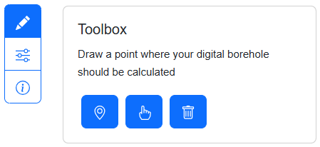
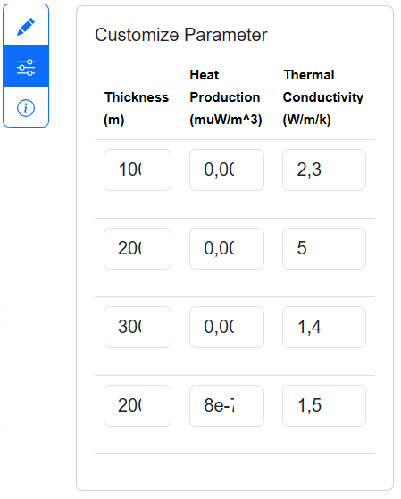
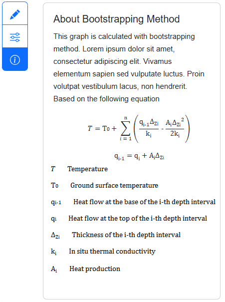
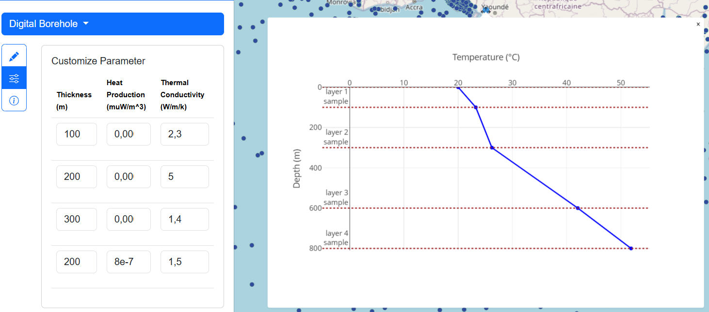
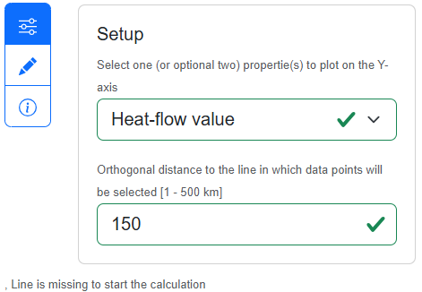
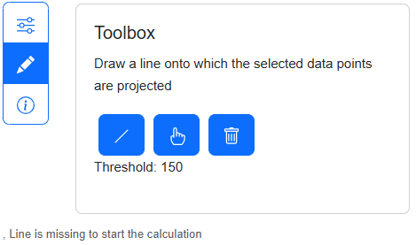
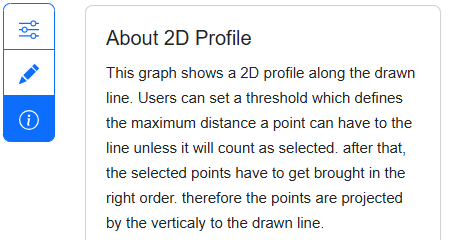
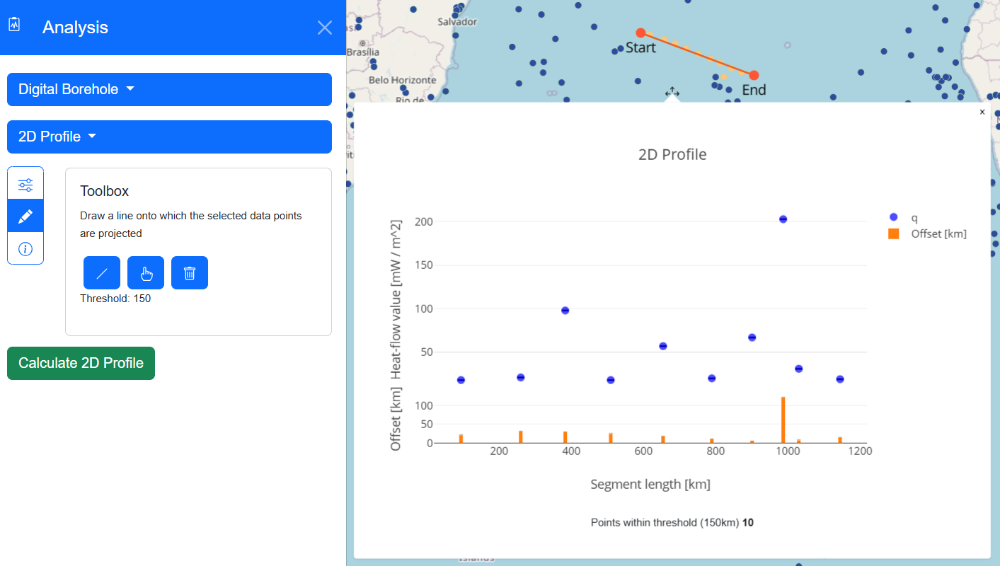

# Analyse Data

In here we provide some heat flow specific analysis functionalities like Digital Borehole and 2D Profile.

**Note:** Both functionalities will display a popup containing a graph. The popup itself cannot be moved, but it is attached to a marker that can be relocated by dragging it.

## Digital Borehole

Users are allowed to draw a point on the map and calcaulate the temperature as function of depth. The calculation is based on the Bootstrapping Method which is described more in detail here 
<!-- TODO: Add source to bootstrap method Chapman, P. L. and Hinkley, D. V. (1986) The double bootstrap, pivots and confidence limits. Report 26. Center for Statistical Sciences, University of Texas at Austin. -->

<math display="block">
        <mi>T</mi>
        <mo>=</mo>
        <mrow>
          <mmultiscripts>
            <mn>T</mn>
            <mn>0</mn>
          </mmultiscripts>
          <mo>+</mo>
          <munderover>
            <mo>∑</mo>
            <mrow>
              <mi>i</mi>
              <mo>=</mo>
              <mn>1</mn>
            </mrow>
            <mrow>
              <mo>n</mo>
            </mrow>
          </munderover>
          <mo>(</mo>
          <mfrac>
            <mrow>
              <msup>
                <mrow>
                  <msub>
                    <mn>q</mn>
                    <mn
                      ><mmultiscripts>
                        <mn>i-1</mn>
                      </mmultiscripts>
                    </mn>
                  </msub>
                </mrow>
              </msup>
              <msup>
                <mrow>
                  <msub>
                    <mn>&Delta;</mn>
                    <mn
                      ><mmultiscripts>
                        <mn>Z</mn>
                        <mn>i</mn>
                      </mmultiscripts>
                    </mn>
                  </msub>
                </mrow>
              </msup>
            </mrow>
            <msup>
              <munder>
                <msup>
                  <mrow>
                    <msub>
                      <mn>k</mn>
                      <mn
                        ><mmultiscripts>
                          <mn>i</mn>
                        </mmultiscripts>
                      </mn>
                    </msub>
                  </mrow>
                </msup>
              </munder>
            </msup>
          </mfrac>
          <mo>-</mo>
          <mfrac>
            <mrow>
              <msup>
                <mrow>
                  <msub>
                    <mn>A</mn>
                    <mn
                      ><mmultiscripts>
                        <mn>i</mn>
                      </mmultiscripts>
                    </mn>
                  </msub>
                </mrow>
              </msup>
              <msup>
                <mrow>
                  <msub>
                    <mn>&Delta;</mn>
                    <mn
                      ><mmultiscripts>
                        <mn>Z</mn>
                        <mn>i</mn>
                      </mmultiscripts>
                    </mn>
                  </msub>
                </mrow>
                <mn>2</mn>
              </msup>
            </mrow>
            <msup>
              <msup>
                <mrow>
                  <msub>
                    <mn>2k</mn>
                    <mn
                      ><mmultiscripts>
                        <mn>i</mn>
                      </mmultiscripts>
                    </mn>
                  </msub>
                </mrow>
              </msup>
            </msup>
          </mfrac>
          <mo>)</mo>
        </mrow>
      </math>

### Draw Toolbox

Specify the location by placing a point on the map. Only one point can be placed at a time, any previously drawn points will be deleted.

### Customize Graph

Once a point is placed, a graph is generated. As per the equation above, each parameter for the layer can be customized within this tab.

### About Bootstrapping

Here, you will find information about the method.

### Results

As a result, a popup will appear on the map at the drawn point. The graph will update automatically if you modify any parameters for the layer within the table.

### Practice example

How to generate a digital borehole?

1) Click the "Analysis" button in the bottom center of the map’s navigation bar.
2) In the analysis panel, select "Digital Borehole."
3) Click the pencil icon to open the draw toolbox --> [Draw Toolbox](#draw-toolbox)
   1) Select the marker icon ("Draw Point") to activate point drawing mode.
   2) Position your cursor at the desired location on the map and click to place the point for the "Digital Borehole."
4) If the graph does not open, click on the marker near your drawn point.
5) To customize the graph --> [Customize Graph](#customize-graph)

## 2D Profile (Cross section)

The 2D Proifle projects values of existing points within a threshold distance to a useres drawn line on the line and displays.

### Setup

### Draw Toolbox

Draw a line to project existing points within a threshold onto the line, generating the 2D profile. Only one line can be active at a time, previously drawn lines will be deleted. Additionally, a line can consist of only two points. If more than two points are drawn, the first and last point will be used.

### About 2D Profile

Here, you can find information about the algorithm used to calculate the graph.

The logic behind the graph is shown in the following figure.

### Results

The results will be a popup showing the points within a users defined threshold.

### Practice example

How to generate a 2D Profile?

1) Click the "Analysis" button located in the bottom center of the map.
2) In the analysis panel, select "2D Profile."
3) Click on the settings icon to open the Setup menu --> [Setup](#setup)
   1) Choose a property.
   2) Set a threshold value.
4) Click the pencil icon to open the draw toolbox --> [Draw Toolbox](#draw-toolbox-1)
   1) Select the line icon ("Draw line") to activate line drawing mode.
   2) Position your cursor on the map and click to define the start and end points of the line.
5) Click "Calculate 2D Profile" to generate the profile.
6) If the graph overlaps with the line, drag the marker connected to the graph to a new position.
7) Hover over any points or bars within the graph, and the corresponding data point on the map will be highlighted.

  
The resulting 2D Profile in the app looks like this.

