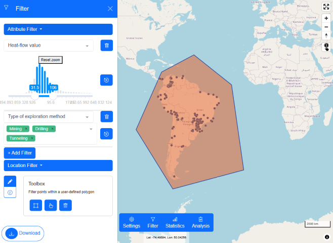
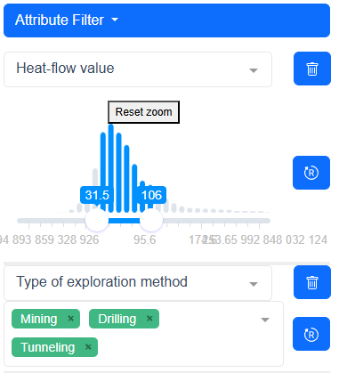
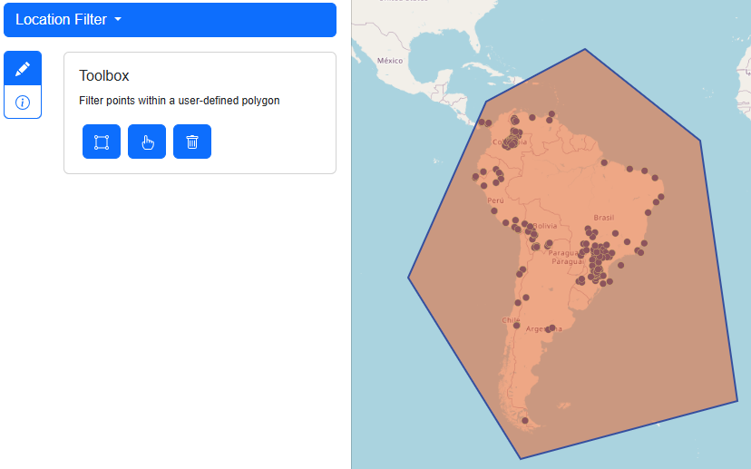

# Filtering Data

Users can choose between two categories of filter. One is based on the attributes of the heat flow values and the other is based on the location of the heat flow values. Filters can also be combined. The picture below will serve as an example. How does this selection of filtered points come about?

```
# Pseudo Code

subsetFilter1 = return points from ghfdb where 31.5mW/m^2 < Heat-flow value < 106mW/m^2
subsetFilter2 = return points from subsetFilter1 if Type of exploration method === Mining OR Drilling OR Tunelling
filteredPoints = return points from subsetFilter2 if points inside polygon
```

 

## Attribute Filter

Click "Add Filter" to create a new filter. Choose a property you want to filter data for. Like in "Data Driven Coloring", the properties are distinguished by their data type. Number values will lead to a interactive histogram. You can shift the minimum and maximum value and set the range like this. Whereas classified properties will lead to a drop-down menu where you can select multiple values of interest.



## Location Filter

The location filter allows users to draw a polygon in which points will be selected. A polygon can be drawn, selected, manipulated or deleted through the draw "Toolbox". The number of polygons is restricted to one.


