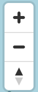
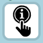
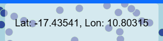

# General Map interaction (Controller)

Controllers are provided to generally interact with the Map. You will find them on the outer edge of the application. This includes:

-  Fullscreen
-  Zoom in and out or align map to north
-  Enable or disable to get Information of a single heat flow value by clicking on it
-  Scale
-  Your current cursor coordinates