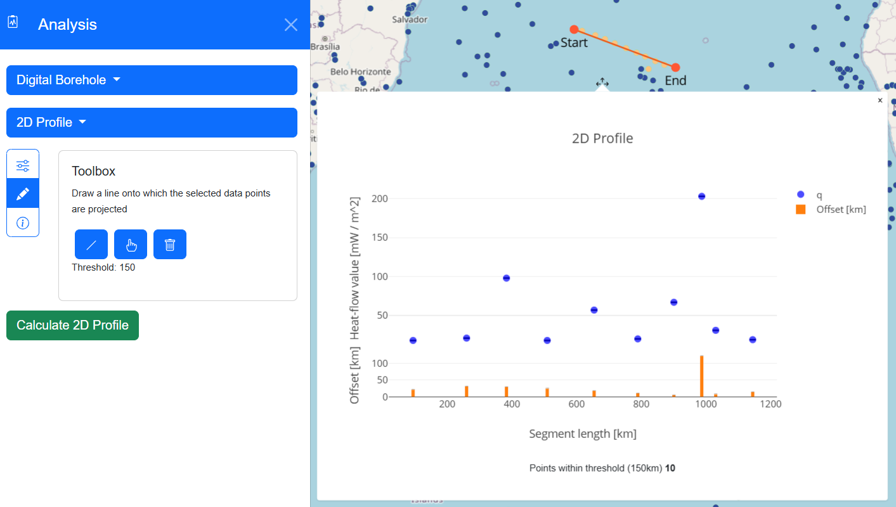

# Practice Examples

## Digital Borehole

How to generate a digital borehole?

1) Click the "Analysis" button in the bottom center of the map’s navigation bar.
2) In the analysis panel, select "Digital Borehole."
3) Click the pencil icon to open the draw toolbox --> [Draw Toolbox](analysisPanel.md#draw-toolbox)
   1) Select the marker icon ("Draw Point") to activate point drawing mode.
   2) Position your cursor at the desired location on the map and click to place the point for the "Digital Borehole."
4) If the graph does not open, click on the marker near your drawn point.
5) To customize the graph --> [Customize Graph](analysisPanel.md#customize-graph)

## 2D Profile (Cross Section)

How to generate a 2D Profile?

1) Click the "Analysis" button located in the bottom center of the map.
2) In the analysis panel, select "2D Profile."
3) Click on the settings icon to open the Setup menu --> [Setup](analysisPanel.md#setup)
   1) Choose a property.
   2) Set a threshold value.
4) Click the pencil icon to open the draw toolbox --> [Draw Toolbox](analysisPanel.md#draw-toolbox-1)
   1) Select the line icon ("Draw line") to activate line drawing mode.
   2) Position your cursor on the map and click to define the start and end points of the line.
5) Click "Calculate 2D Profile" to generate the profile.
6) If the graph overlaps with the line, drag the marker connected to the graph to a new position.
7) Hover over any points or bars within the graph, and the corresponding data point on the map will be highlighted.

  
The resulting 2D Profile in the app looks like this.

