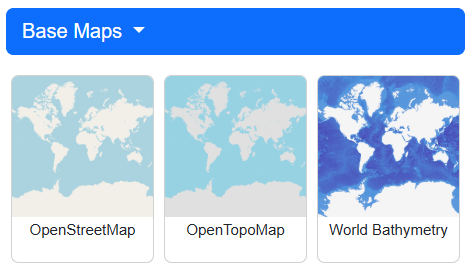
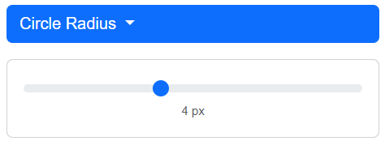
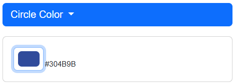
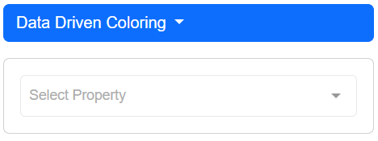
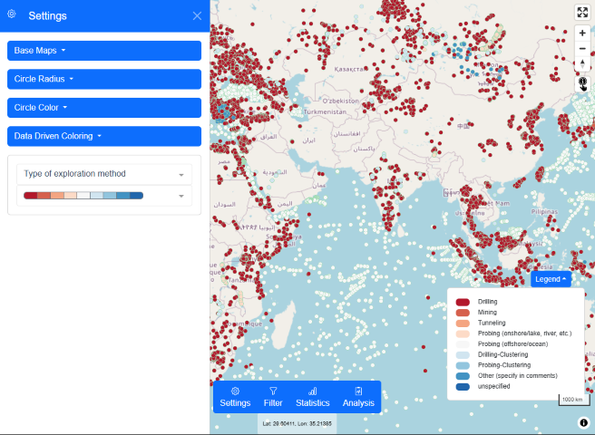
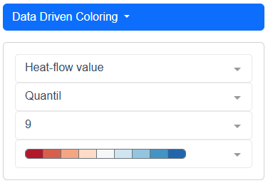
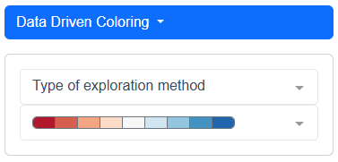

# Settings for visualization

The visualization can be adapted to the user's needs via the settings panel.

## Base Maps

Change the base map here. if you have any suggestions for further free background maps, please share them [here](https://github.com/WorldHeatFlowDatabase/HeatFlowMapping/issues)

 

## Circle Radius

Each heat flow value is represented as circle. The radius of the circle is given in pixel and can be changed here.

 

## Circle Color

Change the circle color on click, color picker, RGB, HSL or HEX.

 

## Data Driven Coloring

 Select an attribute according to which the points get colored. The attributes are divided in number (type number, e.g. Heat-flow value, Heat-flow uncertainty) and classified (type text with predefined classes, e.g. Basic geographical environment, Type of exploration method) properties according to the [The Global Heat Flow Database: Release 2024 - Data Description](https://dataservices.gfz-potsdam.de/panmetaworks/showshort.php?id=e6755429-fbbf-11ee-967a-4ffbfe06208e).   

 

When you have set the property and parameter. A legend will appear in the lower right corner where you can get the information which color is assigned to which class.

 

### Number values like Heat-flow value, Heat-flow uncertainty, ...

The number values are defined within a range. Users can choose between [Quantile](https://pro.arcgis.com/en/pro-app/latest/help/mapping/layer-properties/data-classification-methods.htm#ESRI_SECTION1_1BDD383C17164B948BF546CEADDA70E9) and [Natural breaks - Jenks](https://pro.arcgis.com/en/pro-app/latest/help/mapping/layer-properties/data-classification-methods.htm#ESRI_SECTION1_B47C458CFF6A4EEC933A8C7612DA558B) for data classification. In addition, the number of classes and the color scheme can be defined by the user.

 

### Classified values like, Type of exploration method, Basic geographical environment, ...

The classified properties have pre defined classes as values. Each class is assigned to a color and the color schema can be chosen by the user. Using the example of Type of exploration method, the dataset is split up into the following classes:
- drilling
- mining
- tunneling
- probing (lake)
- probing (ocean)
- unspecified

