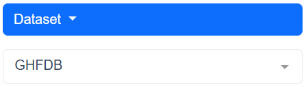
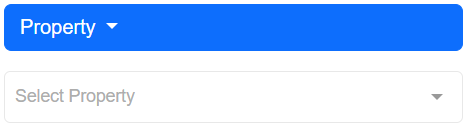
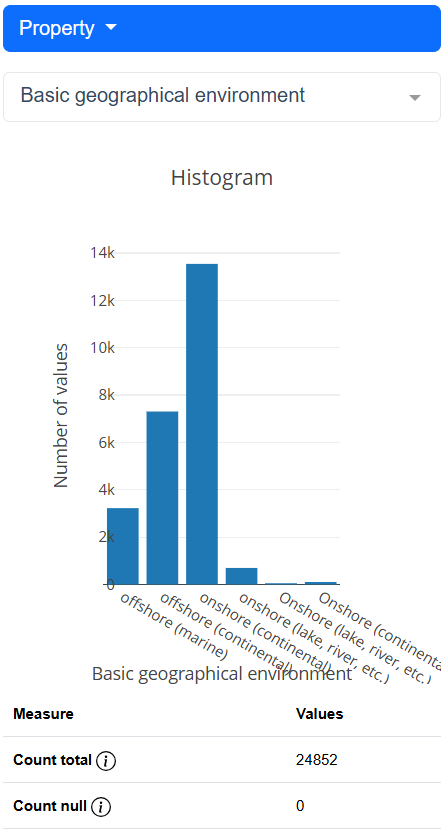
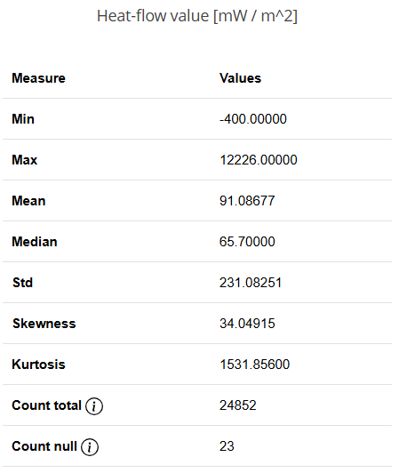

# Statistics about Data

This panel provides you some insides about the data like the distribution, min, max and other descriptiv statistics.

## Select Dataset

You can apply the statistics to either the entire <strong>GHFDB</strong> or a filtered subset. By default, the entire GHFDB is selected. If you've previously applied filters and wish to explore the filtered subset, simply choose the <strong>Filtered GHFDB</strong> option.

## Select Property

Statistics can only be applied to one property at a time, and the results depend on the property's datatype. The properties are categorized into numeric and classified types. Numeric properties will yield more additional values compared to classified properties, like standard deviation, range and so on.

## Results

In both cases, you will receive an interactive histogram. The difference lies in the table below the graph, where numeric properties are accompanied by more detailed statistical values. The following figure shows the result for "Basic geographical environment".

 
 

This is how the table looks like for number proerties like "Heat-Flow value".

